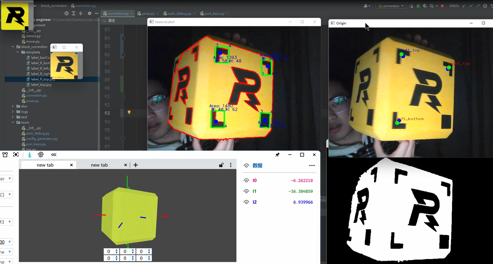
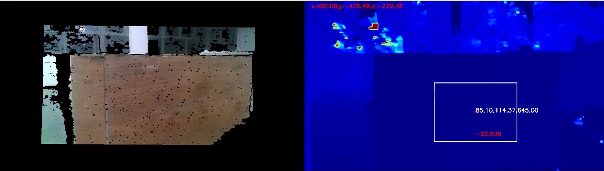
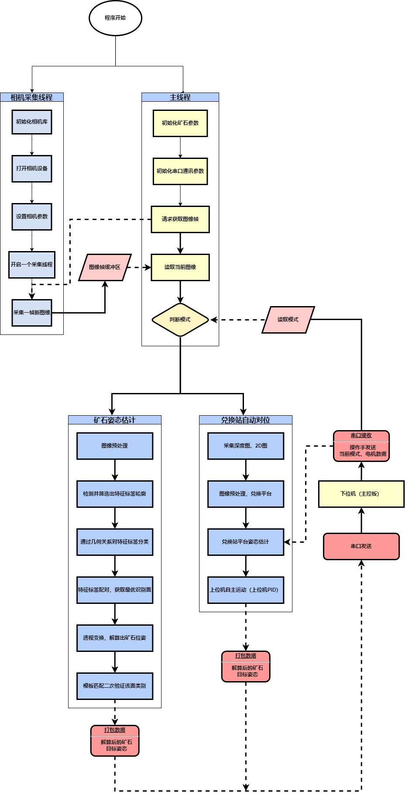
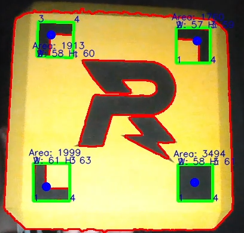
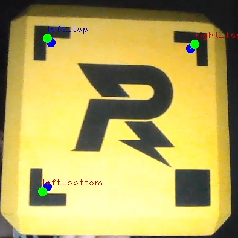

# RM2022-CIDP-工程机器人视觉系统

## 一、项目概况

**项目简介**：RM2022新赛季的趋势是在原有的基础上增加了随机性与不确定性，新赛季我们完成以下几项任务：

**1、自动翻转矿石至指定位姿**


**2、自动对位矿石兑换站**


**项目仓库地址：https://gitee.com/Derkai52/cidp-vision-engineer.git**

**开发环境**：Python3.X   详细环境包请参阅《requirements.txt》

**硬件平台信息：**

> 运算平台：NUC8i5 2.4Ghz
>
> 摄像头（矿石翻转）：KS2A17  60FPS 200万 USB摄像头（OV2710）
>
> 摄像头（自动对位）：Intel RealSense D435 深度相机

##  二、开发设计概览

```python
├── auto_alignment # 机器人自动对位功能
│   ├── detect.py                 # 兑换站的识别
│   └── move.py                   # 控制机器人运动
│
├── block_correction # 矿石自动翻转
│   ├── classify.py               # 分类器，用于区分矿石的不同图案及方向
│   ├── correction.py             # 矿石识别与特征提取
│   └── pose.py                   # 矿石姿态估计
│
├── utils # 工具类
│   ├── auto_debug                # 场前调参工具
│   ├── config_generator.py       # 配置读写类
│   ├── json_keys.py              # json文件键值索引
│   ├── util_file.py              # 常用文件读写类
│   └── log.py                    # 日志类
│
├── logs                          # 日志存放目录
├── doc                           # 文档存放目录
├── communite.py                  # 通讯模块
├── config.json                   # 配置文件
└── main.py                       # 主程序入口
```


###  程序流程图




### 重要算法原理阐述、公式推导

1、利用补光灯，HSV通道预处理良好的结果能够收获高精度的特征点定位。


2、区分“直角特征”和“矩形特征”,对预处理图进行外轮廓检测，并通过轮廓面积与该轮廓最小外接矩形面积 IOU（交并比）系数区分。

通常”直角特征“的IOU占比为30%~50%， 而”矩形特征“的IOU占比为70%~100%



3、通过对比”直角特征“外轮廓质心坐标（绿点）与其最小外接矩形中心坐标（蓝点）的相对位置关系。判断”直角特征“朝向



优点：使用几何特征提取的方法，相对于特征提取网络或传统特征描述算子，计算资源消耗低，同时满足了定位的精度。


## 特别致谢
https://github.com/17S051031/document-scanner

https://github.com/elevenjiang1/RoboMaster2020-OnePointFive